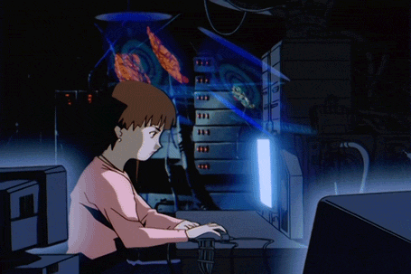
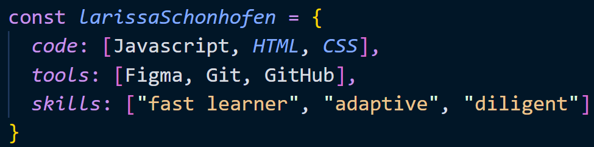

## Bem vindo ao perfil de Larissa Schonhofen:
 

  
  
  

 
  
 
    
                                                                

 
  
 
    
   
    
  <h1>
   
   
   
  </h1>
   
   
    
   
    

